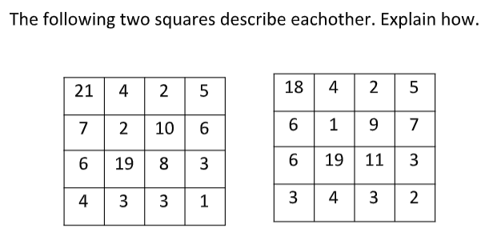
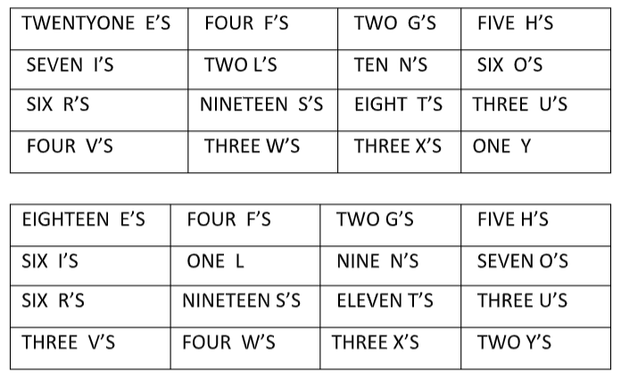

# The Two Squares Puzzle

Greg Ross posted
[this puzzle](https://www.futilitycloset.com/2019/09/28/the-two-squares-puzzle/)
to his excellent Futility Closet blog:

The puzzle was sent to him by Lee Sallows, but I don't know if Lee invented it,
and if not, who did. Let me know if you do, I'll give credit here.

**Spoiler ahead!** Go see the blog post if you want to try to figure it out.

The answer is that each cell in the matrix corresponds to a letter (E,
F, G, etc.) and the number in each cell is the number of times that that
letter shows up in the _other_ square when written in English:

I wrote a Python program to see if there were other solutions. Run it with:

    % python3 two_squares.py

The problem is equivalent to having only one square, repeatedly updating it
based on itself, and looking for cycles of length two. Are there cycles of
other lengths? The most common is length 16. I've also found cycles of length
7, 13, 33, and 39. But amazingly I've also found a cycle of length one, which
is a square that describes itself:

    SIXTEEN E'S     FIVE F'S        ONE G           THREE H'S
    SIX I'S         ONE L           NINE N'S        SEVEN O'S
    SIX R'S         TWENTY S'S      SEVEN T'S       FOUR U'S
    FOUR V'S        THREE W'S       FOUR X'S        TWO Y'S

The program runs forever, looking randomly for cycles it hasn't seen yet.
I've not yet found two cycles of the same length with different
contents.

# License

Copyright 2019 Lawrence Kesteloot

Licensed under the Apache License, Version 2.0 (the "License");
you may not use this file except in compliance with the License.
You may obtain a copy of the License at

   http://www.apache.org/licenses/LICENSE-2.0

Unless required by applicable law or agreed to in writing, software
distributed under the License is distributed on an "AS IS" BASIS,
WITHOUT WARRANTIES OR CONDITIONS OF ANY KIND, either express or implied.
See the License for the specific language governing permissions and
limitations under the License.
